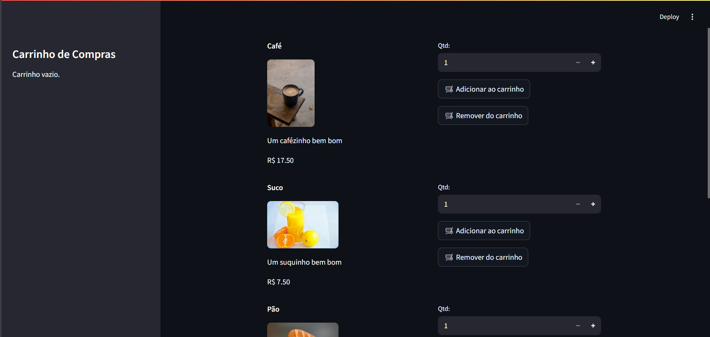
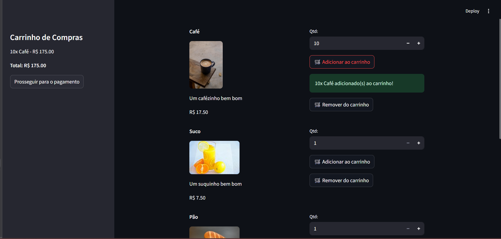
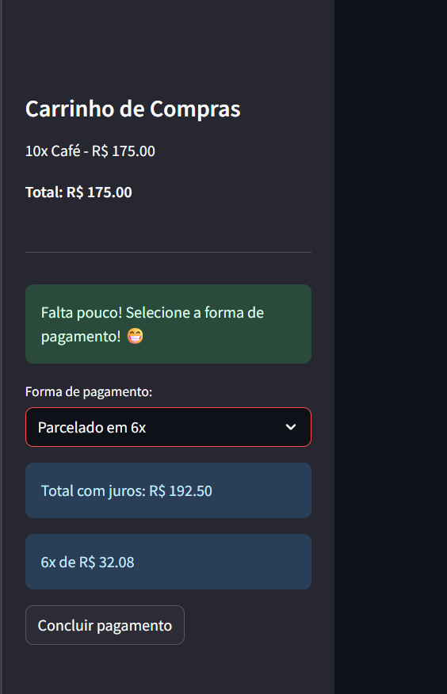

# Venda de Produtos - Streamlit

Este é um projeto simples de venda de produtos desenvolvido em Python utilizando o [Streamlit](https://streamlit.io/). O objetivo é simular um sistema de carrinho de compras, onde o usuário pode adicionar/remover produtos, escolher a forma de pagamento e finalizar a compra.

## Funcionalidades

- Listagem de produtos com imagem, descrição, valor e estoque.
- Adição e remoção de produtos no carrinho, respeitando o estoque disponível.
- Carrinho de compras exibido na barra lateral com total atualizado.
- Botão para prosseguir para o pagamento.
- Seleção de formas de pagamento: à vista ou parcelado (com juros progressivos a partir de 3x).
- Cálculo automático de juros e parcelas.
- Mensagem de sucesso ao concluir a compra e reinício do fluxo para nova compra.
- Interface amigável e responsiva.

## Como rodar o projeto

1. **Clone o repositório ou baixe os arquivos.**

2. **Instale as dependências:**
   ```bash
   pip install streamlit
   ```

3. **Execute o aplicativo:**
   ```bash
   streamlit run app.py
   ```

4. **Acesse o endereço exibido no terminal (geralmente http://localhost:8501) para usar o sistema.**

## Estrutura do Projeto

```
Venda-De-Produtos/
│
├── app.py
├── source/
│   └── images/
│       ├── produtos/
│       └── prints/
└── README.md
```

## Lógica de Pagamento

- **À vista e 2x:** Sem juros.
- **Parcelado em 3x:** 3% de juros.
- **Parcelado em 4x:** 5% de juros.
- **Parcelado em 5x:** 7% de juros.
- **Parcelado em 6x:** 10% de juros.
- **Parcelado em 7x:** 13% de juros.
- **Parcelado em 8x:** 16% de juros.

O valor total e o valor de cada parcela são exibidos automaticamente ao selecionar a forma de pagamento.

## Personalização

- Para alterar os produtos, edite a lista `lista_produtos` no início do arquivo `app.py`.
- O estilo dos botões pode ser customizado via CSS no próprio código.

## Prints do Sistema

Abaixo, alguns exemplos do funcionamento do sistema:

1. **Tela principal:**  
   Exibe todos os produtos disponíveis para venda, com imagem, descrição, preço e estoque.
   
   

2. **Produtos sendo adicionados ao carrinho:**  
   Mostra o carrinho na barra lateral sendo atualizado conforme os produtos são adicionados.
   
   

3. **Sistema de pagamentos e opções de parcelamento:**  
   Exibe as opções de pagamento, incluindo parcelamento com cálculo automático de juros e valor das parcelas.
   
   

4. **Carrinho limpo após o término da compra:**  
   Após finalizar a compra, o sistema mostra uma mensagem de sucesso e o carrinho é automaticamente limpo, pronto para uma nova compra.
   
   

---

Projeto para fins didáticos e de prática de lógica de programação com Python e Streamlit.