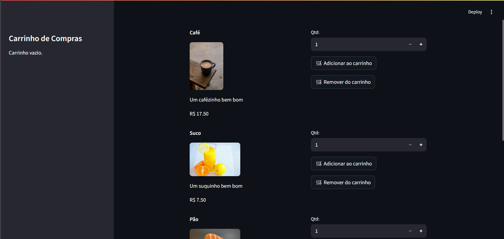
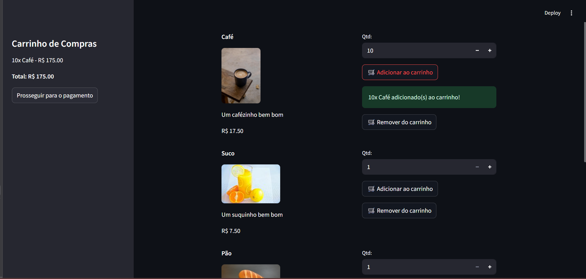
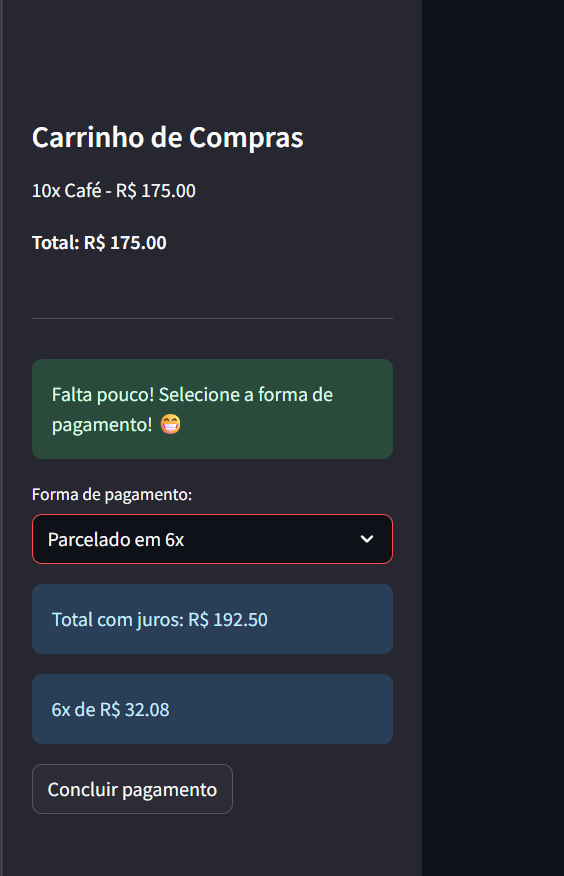

# Venda de Produtos - Streamlit

## Visão Geral

Este projeto simula um sistema de venda de produtos com carrinho de compras, desenvolvido em Python utilizando o [Streamlit](https://streamlit.io/). O objetivo é proporcionar uma experiência interativa de compra, permitindo adicionar/remover produtos, visualizar o carrinho, escolher a forma de pagamento (com cálculo de juros para parcelamentos) e finalizar a compra.

---

## Estrutura do Projeto

```
Sistema-de-vendas/
│
├── README.md
└── app/
    ├── app.py
    ├── ideias.py
    ├── requirements.txt
    └── source/
        └── images/
            ├── produtos/
            │   ├── coffee1.jpg
            │   ├── juice1.jpg
            │   ├── bread1.jpg
            │   └── milk1.jpg
            └── prints/
                ├── print1.png
                ├── print2.png
                ├── print3.png
                └── print4.png
```
- **app/app.py**: Código principal do sistema.
- **app/source/images/produtos/**: Imagens dos produtos exibidos na loja.
- **app/source/images/prints/**: Prints de tela para documentação/apresentação.
- **README.md**: Documentação do projeto.
---

## Como Executar

1. **Instale as dependências:**
   ```bash
   pip install streamlit
   ```

2. **Execute o aplicativo:**
   ```bash
   streamlit run app.py
   ```

3. **Acesse o endereço exibido no terminal (geralmente http://localhost:8501).**

4.**OU Acesse pelo link: https://sistema-de-vendas-1p.streamlit.app/ (para facilitar sua vida).**
---

## Explicação do Código 💻

### 1. Importação e Lista de Produtos

```python
import streamlit as st

lista_produtos = [
    {"nome": "Café", "valor": 17.50, "quantidade": 20, ... "imagem": "source/images/produtos/coffee1.jpg"},
    ...
]
```
- **Por quê?**  
  Importa o Streamlit e define os produtos disponíveis, cada um com nome, valor, quantidade em estoque, descrição, id e caminho da imagem.

---

### 2. Função de Conclusão de Pagamento

```python
def concluir_pagamento():
    st.session_state["carrinho"] = {}
    st.session_state["pagamento"] = False
    st.session_state["compra_sucesso"] = True
```
- **Por quê?**  
  Centraliza a lógica de finalizar a compra: limpa o carrinho, reseta o estado de pagamento e ativa a mensagem de sucesso.

---

### 3. Inicialização das Variáveis de Sessão

```python
if "carrinho" not in st.session_state:
    st.session_state["carrinho"] = {}
if "pagamento" not in st.session_state:
    st.session_state["pagamento"] = False
if "compra_sucesso" not in st.session_state:
    st.session_state["compra_sucesso"] = False
if "processar_pagamento" not in st.session_state:
    st.session_state["processar_pagamento"] = False
```
- **Por quê?**  
  Garante que as variáveis de controle estejam sempre disponíveis e inicializadas corretamente ao abrir ou atualizar a página.

---

### 4. Exibição dos Produtos e Botões

```python
for produto in lista_produtos:
    ...
    if st.button("🛒 Adicionar ao carrinho", key=f"add_{produto['id']}"):
        ...
    if st.button("🛒 Remover do carrinho", key=f"remove_{produto['id']}"):
        ...
```
- **Por quê?**  
  Mostra cada produto com imagem, descrição, preço e botões para adicionar/remover do carrinho.  
  O botão "Adicionar" só permite adicionar até o limite do estoque.  
  O botão "Remover" remove a quantidade desejada ou o produto inteiro se chegar a zero.

---

### 5. Carrinho de Compras na Barra Lateral

```python
st.sidebar.title("Carrinho de Compras")
...
if st.session_state["carrinho"]:
    ...
    if not st.session_state["pagamento"]:
        if st.sidebar.button("Prosseguir para o pagamento"):
            st.session_state["pagamento"] = True
```
- **Por quê?**  
  Exibe o carrinho atualizado na barra lateral, mostrando os itens, quantidades e total.  
  O botão "Prosseguir para o pagamento" só aparece se houver itens no carrinho.

---

### 6. Sistema de Pagamento

```python
if st.session_state["pagamento"]:
    ...
    opcao = st.sidebar.selectbox("Forma de pagamento:", opcoes_pagamento)
    ...
    st.sidebar.button("Concluir pagamento", on_click=concluir_pagamento)
```
- **Por quê?**  
  Permite ao usuário escolher a forma de pagamento (à vista ou parcelado).  
  Calcula automaticamente os juros e o valor das parcelas conforme a opção escolhida.  
  O botão "Concluir pagamento" finaliza a compra e exibe a mensagem de sucesso.

---

### 7. Mensagem de Sucesso

```python
if st.session_state.get("compra_sucesso", False):
    st.sidebar.markdown("---")
    st.sidebar.success("✅ Compra realizada com sucesso! Obrigado pela preferência. 🎉")
```
- **Por quê?**  
  Exibe um card de sucesso após a compra, agradecendo o usuário e indicando que o carrinho foi limpo e está pronto para uma nova compra.

---

### 8. Controle de Fluxo

- O fluxo do sistema é controlado por variáveis de sessão (`st.session_state`), garantindo que cada etapa (carrinho, pagamento, sucesso) seja exibida no momento certo.
- O carrinho só é limpo após a confirmação do pagamento.
- A mensagem de sucesso permanece até que o usuário inicie uma nova compra.

---

## Lógica de Pagamento 💳

- **À vista e 2x:** Sem juros.
- **Parcelado em 3x:** 3% de juros.
- **Parcelado em 4x:** 5% de juros.
- **Parcelado em 5x:** 7% de juros.
- **Parcelado em 6x:** 10% de juros.
- **Parcelado em 7x:** 13% de juros.
- **Parcelado em 8x:** 16% de juros.

O valor total e o valor de cada parcela são exibidos automaticamente ao selecionar a forma de pagamento.

---

## Prints do Sistema 📸

1. **Tela principal:**  
   Exibe todos os produtos disponíveis para venda, com imagem, descrição, preço e estoque.
   
   

2. **Produtos sendo adicionados ao carrinho:**  
   Mostra o carrinho na barra lateral sendo atualizado conforme os produtos são adicionados.
   
   

3. **Sistema de pagamentos e opções de parcelamento:**  
   Exibe as opções de pagamento, incluindo parcelamento com cálculo automático de juros e valor das parcelas.
   
   

4. **Carrinho limpo após o término da compra:**  
   Após finalizar a compra, o sistema mostra uma mensagem de sucesso e o carrinho é automaticamente limpo, pronto para uma nova compra.
   
   

---

## Dicas para Apresentação (segundo a i.a 🤓🤓)

- Explique o fluxo: adicionar/remover produtos, visualizar o carrinho, escolher a forma de pagamento, finalizar compra.
- Mostre como o sistema impede adicionar mais itens do que o estoque.
- Demonstre o cálculo automático de juros e parcelas.
- Destaque a experiência do usuário: mensagem de sucesso e carrinho pronto para nova compra.
- Mostre o código e explique o uso de variáveis de sessão para controle de estado.


---

Projeto para fins didáticos e de prática de lógica de programação com Python e Streamlit.